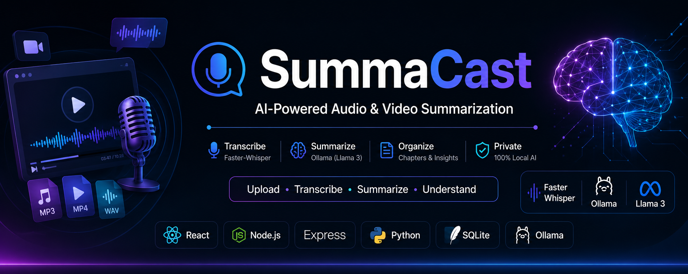

<p align="center">
  
</p>

<h1 align="center">🎙️ SummaCast</h1>

<p align="center">
  <strong>AI-Powered Audio & Video Summarization Platform</strong><br>
  Built with React, Node.js, Faster-Whisper, and Ollama (Llama 3)
</p>

<p align="center">
  
  
  
  
  
  
  
</p>

---

# 📖 About

**SummaCast** is a full-stack AI application that converts long audio and video content into concise, structured summaries.

Unlike traditional AI summarization tools, SummaCast performs the complete AI pipeline **locally** using **Faster-Whisper** for speech-to-text transcription and **Ollama (Llama 3)** for summarization. This eliminates the need for cloud AI APIs while improving privacy and reducing operating costs.

---

# ✨ Features

- 🎥 Upload video files
- 🎙️ Upload audio files
- 📝 Automatic speech-to-text transcription
- 🤖 AI-generated summaries
- 📚 Chapter generation
- 📺 YouTube video processing
- ⚡ Faster-Whisper transcription
- 🦙 Ollama (Llama 3) summarization
- 💾 SQLite database
- 🔒 Fully local AI processing
- 🚀 Fast and lightweight architecture

---

# 🛠️ Tech Stack

| Category | Technologies |
|----------|--------------|
| Frontend | React, Vite |
| Backend | Node.js, Express.js |
| AI Worker | Python |
| AI Models | Faster-Whisper, Ollama (Llama 3) |
| Database | SQLite |
| Storage | Local File Storage |

---

# 🏗️ System Architecture

```
                User
                  │
                  ▼
       Upload Audio / Video
                  │
                  ▼
          React Frontend
                  │
                  ▼
          Express Backend
                  │
                  ▼
        Python Worker Service
                  │
       ┌──────────┴──────────┐
       ▼                     ▼
 Faster-Whisper       YouTube Captions
       │                     │
       └──────────┬──────────┘
                  ▼
             Transcript
                  │
                  ▼
        Ollama (Llama 3)
                  │
                  ▼
     Summary • Chapters • Notes
                  │
                  ▼
           React Frontend
```

---

# 📂 Project Structure

```
SummaCast
│
├── assets/
│   └── banner.png
│
├── backend/
│
├── frontend/
│
├── worker/
│
├── screenshots/
│
├── README.md
│
└── database.sqlite
```

---

# 🚀 Installation

## Clone Repository

```bash
git clone https://github.com/vrushtipatel12/SummaCast.git
cd SummaCast
```

## Install Backend

```bash
cd backend
npm install
```

## Install Frontend

```bash
cd frontend
npm install
```

## Install Python Worker

```bash
pip install -r worker/requirements.txt
```

## Install Ollama

Download Ollama from:

https://ollama.com

Pull the required model:

```bash
ollama pull llama3
```

---

# ▶️ Run the Project

### Start Ollama

```bash
ollama serve
```

### Start Worker

```bash
python worker/main.py
```

### Start Backend

```bash
cd backend
npm run dev
```

### Start Frontend

```bash
cd frontend
npm run dev
```

---

# 📸 Screenshots

## 🏠 Home Page

> Add screenshot here

```
screenshots/home.png
```

---

## 📤 Upload Page

> Add screenshot here

```
screenshots/upload.png
```

---

## 🎥 Video Player

> Add screenshot here

```
screenshots/video.png
```

---

## 📝 Transcript

> Add screenshot here

```
screenshots/transcript.png
```

---

## 🤖 AI Summary

> Add screenshot here

```
screenshots/summary.png
```

---

# 🌟 Future Improvements

- 🌍 Multi-language translation
- 💬 Chat with transcript
- 📄 PDF export
- 📑 DOCX export
- 👥 Speaker diarization
- 🎯 AI quiz generation
- 📱 Mobile responsive UI
- ☁️ Cloud deployment
- 🔍 Keyword search
- 📊 Analytics dashboard

---

# 👩‍💻 Author

**Vrushti Patel**

GitHub: https://github.com/vrushtipatel12

---

# ⭐ Support

If you found this project useful, please consider giving it a **⭐ Star** on GitHub.

Your support helps improve the project and makes it easier for others to discover it.

---

<p align="center">
Made with ❤️ using React, Node.js, Faster-Whisper & Ollama
</p>
